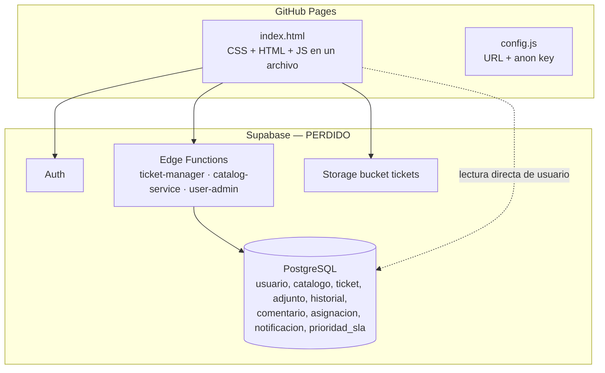

# LuxFBD — Análisis del estado actual y rumbo del proyecto

**Fecha:** 20 de septiembre de 2026
**Alcance:** repositorio `LuxFBD` (frontend + funciones Supabase) contrastado con el documento *Proyecto Integrador Final – Fundamentos de Base de Datos* (PIFinal.HOI.docx) y con el mercado de sistemas de tickets.
**Contexto crítico:** el proyecto de Supabase original (`nsrduorngzyoiwpbkgku`) **ya no existe**. Se perdieron base de datos, usuarios, evidencias y funciones desplegadas. Hoy solo existe el frontend, el código fuente de las funciones y el diseño documentado.

---

## 0. Resumen ejecutivo

| Pregunta | Respuesta corta |
|---|---|
| ¿Qué es? | Un módulo de **soporte por tickets integrado en el campus digital** de Universidad Lux: el alumno reporta incidencias mediante un asistente conversacional (Lux-IA) y el personal de soporte las gestiona desde un panel. |
| ¿Qué está construido y funciona? | La **interfaz completa** (login, dashboard, chatbot guiado, panel de soporte, detalle de ticket con historial y evidencias, reasignación) y el **esqueleto de la API** (5 endpoints). Funcionaba de punta a punta hasta que se perdió el backend. |
| ¿Qué falta? | 9 de 17 requerimientos funcionales no existen: comentarios, cambio de estado/prioridad, cierre, SLA/ETA, notificaciones, filtros y consulta de estado desde el chat. |
| ¿Qué hay que rehacer? | Todo el backend (base de datos, políticas, storage, despliegue) — no por mala calidad sino porque **se perdió y nunca estuvo versionado**. Además la capa de datos del frontend y la autorización de la API, por seguridad. |
| ¿Calidad del código? | **Prototipo funcional, no producto**: 3.0 / 5. Buen diseño visual y flujo de chat claro; seguridad, estructura y reproducibilidad deficientes. |
| ¿Nos sirve lo hecho? | **Sí.** Se conserva ~70 % del frontend (diseño, flujo conversacional, pantallas) y el 100 % del diseño de datos (documento + diagrama). Se reescribe lo que de todos modos hay que rehacer. |
| ¿Vamos por buen camino? | **Sí, para el contexto** (materia de BD + concurso). Contra el mercado, nuestra ventaja no es la cantidad de funciones sino la **entrada conversacional integrada al campus**, la **transparencia hacia el alumno** (ETA, historial) y la **analítica de fallas recurrentes**. Hay que cuidar no intentar igualar a Zendesk. |

---

## 1. Qué hace el proyecto (según lo que realmente está construido)

### 1.1 Propósito

Sustituir el reporte de fallas de la plataforma universitaria por correo o en ventanilla con un sistema centralizado de incidencias, donde:

- **Usuario reportador** (alumno, maestro, administrativo) crea tickets, adjunta evidencia y consulta su estado.
- **Usuario de soporte** (área "Virtual") recibe, asigna, actualiza y resuelve.

### 1.2 Flujo real implementado

```mermaid
flowchart LR
    A[Login<br/>correo institucional] --> B{Rol}
    B -- Alumno / Maestro --> C[Dashboard de cursos<br/>(mock estático)]
    C --> D[Chat Lux-IA]
    D --> E[Flujo guiado:<br/>título → categoría → detalles<br/>→ evidencia → prioridad → área]
    E --> F[POST /ticket-manager/create]
    F --> G[(ticket + adjunto)]
    B -- Soporte --> H[Panel Soporte LuxIA<br/>tabla de tickets]
    H --> I[Modal de detalle:<br/>datos, evidencias, historial]
    I --> J[Reasignar → PUT /update]
    C -. nav "Soporte LuxIA" .-> H
```

1. **Login** con Supabase Auth (`signInWithPassword`); se lee `usuario.tipo_usuario` para decidir la vista.
2. **Dashboard de alumno**: tarjetas de cursos *hardcodeadas* (decorado para dar contexto de "campus").
3. **Chat Lux-IA**: máquina de estados de 7 pasos que recopila el ticket con botones de opción y texto libre; sube la evidencia al bucket `tickets` y llama al endpoint de creación.
4. **Panel de soporte**: tabla de tickets (todos para staff, propios para el alumno); modal con estado, prioridad, área, reportador, asignado, detalles, evidencias (visor de imágenes) e historial; dropdown para reasignar.

### 1.3 Arquitectura actual



### 1.4 Inventario

| Archivo | Líneas | Rol | Estado |
|---|---|---|---|
| `index.html` | 1 967 | Todo el frontend (CSS 936 · HTML 257 · JS 758) | ✅ existe |
| `config.js` | 4 | Credenciales públicas de Supabase | ⚠️ apunta a proyecto muerto |
| `supabase/functions/ticket-manager/index.ts` | 322 | API: `/create`, `/list`, `/details`, `/update`, `/staff` | ✅ fuente · 💀 no desplegada |
| `supabase/functions/catalog-service/index.ts` | 48 | Catálogos (categorías, prioridades, estados, áreas) | ✅ fuente · 💀 no desplegada |
| `supabase/functions/user-admin/index.ts` | 56 | `/profile`, `/sync` (placeholder) | ⚰️ código muerto: nadie la llama |
| `confirm_users.sql` | 11 | Confirmar correos masivamente (bypass) | 🗑️ retirar |
| `supabase/migrations/` | — | Esquema versionado | ❌ **nunca existió** |
| Pruebas, linter, CI | — | — | ❌ no existen |

---

## 2. Estado por componente: qué funciona, qué falta, qué se rehace

Leyenda: ✅ funciona · ⚠️ funciona con defectos · ❌ no existe · 🔁 rehacer · 💀 perdido

### 2.1 Frontend

| Componente | Estado | Detalle |
|---|---|---|
| Login | ⚠️ | Funciona. Sin persistencia de sesión al recargar, sin cerrar sesión, "Olvidé mi contraseña" e "Invitado" sin acción. |
| Dashboard de cursos | ✅ (mock) | Decorado estático. Cumple su función de contexto; no es parte del alcance de tickets. |
| Chat Lux-IA — flujo de reporte | ⚠️ | Flujo completo y claro. Defectos: botón "Salir" sin acción, opciones de pasos anteriores siguen activas, carrera de 1 s tras crear ticket, el paso "área" se recopila pero se descarta. |
| Chat Lux-IA — consultar estado | ❌ | Responde "disponible pronto". |
| Subida de evidencia | ⚠️ | Funciona (1 archivo). Bucket público; sin validación de tipo/tamaño en servidor. |
| Panel de soporte (tabla) | ⚠️ | Funciona. **XSS almacenado** al renderizar títulos; sin filtros ni orden; navegación rompe las demás vistas. |
| Detalle de ticket (modal) | ⚠️ | Funciona con historial y evidencias. XSS en detalles/historial/nombres; ETA fija en "Pendiente". |
| Reasignación | ⚠️ | Funciona para `Soporte`. El rol `Administrador` ve el control pero el servidor lo rechaza. |
| Cambio de estado / prioridad / cierre | ❌ | Sin controles en la UI. |
| Comentarios | ❌ | — |
| Notificaciones | ❌ | Iconos 🔔 ✉️ decorativos. |
| Catálogos dinámicos | ⚠️ | `loadCatalogs()` corre antes del login y siempre falla → se usan IDs estáticos. Si funcionara, las prioridades no coincidirían (`baja/media/alta` vs `Bajo/Medio/Crítico`). |

### 2.2 Backend (Edge Functions — fuente existe, despliegue perdido)

| Endpoint | Estado | Detalle |
|---|---|---|
| `POST /create` | 🔁 | Lógica correcta en lo básico. Ignora `area_notificada_id` (fija 38), `estado_id` fijo en 1, no registra historial de creación, el adjunto puede fallar en silencio. |
| `GET /list` | 🔁 | Filtro por rol **fail-open**: cualquier rol no listado ve todos los tickets. |
| `GET /details` | 🔁 | **Sin autorización**: cualquier usuario autenticado ve cualquier ticket; el historial se lee con *service role*. |
| `PUT /update` | 🔁 | Acepta `estado_id` y asignación; no acepta prioridad; historial sin valor anterior; lista de roles inconsistente con el frontend. |
| `GET /staff` | 🔁 | Accesible para alumnos (fuga de la nómina de soporte). |
| `catalog-service` | ⚠️ | Correcta; sin `verify_jwt` claro. |
| `user-admin` | ⚰️ | Eliminar; su propósito (`/sync`) se resuelve con un trigger en la DB. |

### 2.3 Datos e infraestructura

| Pieza | Estado | Detalle |
|---|---|---|
| Base de datos (9 tablas) | 💀 → 🔁 | Se reconstruye desde el script del documento adaptado a PostgreSQL + columnas que la DB real tenía (`auth_uid`, `mime_type`, `eta_estimada`, `codigo`…) + mejoras exigidas por el propio documento (`prioridad_reportada_id`, uso de `asignacion`, SLA). |
| Catálogo (semilla) | 💀 → 🔁 | Categorías: Finanzas, Sitio Web, Servo Web, Materias, Bloqueos/Acceso · Prioridades: Bajo, Medio, Crítico · Estados: Abierto, En proceso, Esperando respuesta, Resuelto, Cerrado · Áreas: Servicios Escolares, Soporte Técnico. |
| RLS / políticas | ❌ (nunca versionadas) | Se escriben desde cero. |
| Storage | 💀 → 🔁 | Bucket privado con políticas y límites. |
| Usuarios Auth | 💀 → 🔁 | Cuentas de prueba alumno/soporte. |
| Despliegue | ❌ | Nada automatizado; se crea CI con GitHub Actions. |

### 2.4 Cumplimiento de requerimientos (documento vs. código)

| RF | Requerimiento | Estado |
|---|---|---|
| RF-001 | Crear ticket | ✅ |
| RF-002 | Campos del ticket (título, detalles, evidencia, categoría, prioridad percibida, notificar maestro/área) | ⚠️ área se descarta; maestro no existe; **prioridad reportada separada de la oficial** no existe |
| RF-003 | Reportador comenta sus tickets | ❌ |
| RF-004 | Historial de cambios y comentarios | ⚠️ solo reasignación, sin valor anterior, sin creación |
| RF-005 | Panel del reportador | ✅ |
| RF-006 | Estados (5 mínimos, catálogo configurable) | ⚠️ estado inicial hardcodeado; verificar los 5 |
| RF-007 | Tiempo estimado (SLA por prioridad) | ❌ "Pendiente" fijo |
| RF-008 | Retroalimentación de soporte dentro del ticket | ❌ |
| RF-009 | Panel de administración | ✅ |
| RF-010 | Filtrar/ordenar por categoría, prioridad, fecha, estado | ❌ |
| RF-011 | Asignar a miembro de soporte | ⚠️ usa columna del ticket en vez de tabla `asignacion` |
| RF-012 | Reasignar con historial | ⚠️ |
| RF-013 | Cambiar estado y prioridad oficial | ❌ |
| RF-014 | Comentarios internos / externos | ❌ |
| RF-015 | Cerrar ticket | ❌ |
| RF-016 | Notificaciones al reportador | ❌ |
| RF-017 | Notificaciones a soporte | ❌ |

**4 cumplidos · 5 parciales · 8 ausentes.** El núcleo *crear → listar → ver → asignar* existe; el ciclo de vida posterior no.

---

## 3. Calidad del código

### 3.1 Calificación por dimensión

| Dimensión | Nota (1–5) | Evidencia |
|---|---|---|
| Diseño visual / UX | **4** | Interfaz limpia, coherente con un campus digital; el chat guiado reduce fricción frente a un formulario. |
| Legibilidad | **3** | Nombres claros y comentarios útiles; pero 1 967 líneas en un archivo, tres idiomas mezclados (ES/EN) en identificadores. |
| Estructura / modularidad | **2** | CSS + HTML + JS en un archivo; sin módulos; lógica de negocio (IDs de catálogo, reglas de rol) duplicada en cliente y servidor. |
| Seguridad | **1** | XSS almacenado en el panel de soporte; `/details` sin autorización; lista fail-open; bucket público; `error.message` de Postgres expuesto; CORS `*`. |
| Robustez / manejo de errores | **2** | Fallos silenciosos (adjunto, historial); todo error HTTP → 400; sin validación de entrada; carreras en el chat. |
| Mantenibilidad | **2** | `projectRef` hardcodeado 6 veces; patrón `getSession → fetch` copiado 6 veces; 4 listas de roles distintas; IDs mágicos (33–38, 6–8, 1). |
| Pruebas | **1** | Ninguna. |
| Reproducibilidad / DevOps | **1** | Sin migraciones, sin CI, sin respaldos → el proyecto se perdió por completo. |
| **Promedio** | **2.0** — con peso extra en UX y flujo funcional, **3.0 / 5 como prototipo** | |

### 3.2 Lo que está bien hecho (y vale la pena conservar)

- **Flujo conversacional como máquina de estados** (`STEPS_FLOW`, `getNextStep`, `showStepPrompt`): fácil de extender con nuevos pasos; el botón "Atrás" funciona.
- **Separación cliente / API**: el frontend no escribe tablas directamente (salvo la lectura de perfil); la API concentra la lógica. La idea es correcta aunque la ejecución tenga huecos.
- **Inicialización segura** de Supabase (modo offline si falta config) y mapas estáticos de respaldo.
- **CSS bien organizado** con variables, responsivo, sin dependencias.
- **Subida de evidencias** con nombre saneado y ruta por usuario.
- Historial con *service role* bien intencionado: entendieron que RLS bloqueaba, aunque la solución correcta son triggers.

### 3.3 Lo que está mal (y por qué importa)

| Problema | Impacto | Dónde |
|---|---|---|
| `innerHTML` con datos de usuario sin escapar | Un alumno inyecta JS que se ejecuta en la sesión del personal de soporte | `index.html` render de tabla y modal |
| `/details` no verifica dueño ni rol | Cualquier alumno lee cualquier ticket e historial | `ticket-manager` |
| Filtro de `/list` por lista de exclusión | Rol nuevo o mal escrito = ve todo | `ticket-manager` |
| Bucket público con `getPublicUrl` | Capturas con datos financieros accesibles por URL | frontend + storage |
| Reglas de negocio en el cliente (IDs, roles, prioridad por defecto) | Se rompe en cualquier otra instancia de la DB; inconsistencias cliente/servidor | ambos |
| Sin esquema versionado | **Ya costó el proyecto entero** | repo |
| Clases Tailwind sin Tailwind, CSS inválido en `style=""` | Estilos que no aplican; señal de copiar/pegar sin verificar | `index.html` |
| Función `user-admin` muerta, `confirm_users.sql` de bypass | Ruido y mala práctica de seguridad | repo |

---

## 4. ¿Realmente nos sirve lo que está hecho?

**Sí, y bastante.** No conviene empezar de cero. Lo que se perdió (backend) hay que rehacerlo de todos modos; lo que sobrevivió es precisamente la parte más costosa de producir desde cero: el diseño de la experiencia.

| Pieza | Decisión | Reutilización estimada | Trabajo |
|---|---|---|---|
| CSS y diseño visual | **Conservar** | 90 % | Extraer a `styles.css`; quitar clases Tailwind y estilos inline inválidos |
| HTML de pantallas (login, dashboard, panel, modal, chat, visor) | **Conservar** | 80 % | Añadir controles nuevos (estado, prioridad, cerrar, comentarios, filtros, campana) |
| Chat Lux-IA (máquina de estados) | **Conservar y corregir** | 70 % | Deshabilitar opciones usadas, "Salir", consulta de estado, enviar área |
| Capa de datos del frontend (fetch, sesión, catálogos) | **Reescribir** | 30 % | Un `api.js` con un helper, sesión persistente, catálogos tras login |
| Render del panel y modal | **Reescribir** | 50 % | Escapar HTML, plantillas, filtros |
| Edge Functions | **Reescribir sobre el esqueleto** | 40 % | Mismo enrutado y CORS; autorización, validación y códigos HTTP nuevos |
| Base de datos | **Nueva, desde el diseño existente** | 0 % código · 100 % diseño | Migraciones: esquema, semilla, RLS, funciones, triggers, storage |
| Documento del proyecto | **Actualizar** | 85 % | Script en PostgreSQL, diagrama sin traducir, endpoints reales, quitar credenciales |

**Conclusión:** el activo real del proyecto es la *idea de producto* (asistente conversacional dentro del campus) y el diseño de datos. El código existente es un prototipo válido para demostrarla; para convertirlo en algo defendible ante un jurado hay que endurecer la base (seguridad + reproducibilidad) y completar el ciclo de vida del ticket.

---

## 5. Benchmark con la competencia

"Competencia" aquí significa: **lo que una universidad compraría o instalaría en lugar de construir LuxFBD.** Sirve para dos cosas: saber qué es *estándar* (lo que no puede faltar) y qué es *diferencial* (donde podemos ganar).

### 5.1 Panorama

| Producto | Tipo | Costo aprox. (2026) | Para quién |
|---|---|---|---|
| **Zendesk** | SaaS empresarial | desde ≈ US$19 hasta US$115+ por agente/mes | Soporte a clientes a gran escala |
| **Freshdesk** | SaaS | plan gratuito limitado (2 agentes, 6 meses, sin SLA ni automatizaciones); Growth ≈ US$15–19 por agente/mes | PyMEs y equipos de soporte |
| **Jira Service Management** | SaaS (Atlassian) | gratis hasta 3 agentes; Standard ≈ US$20 por agente/mes | Equipos de TI que ya usan Jira |
| **osTicket** | Open source (PHP/MySQL), autohospedado | gratis | Helpdesk clásico por correo/portal |
| **GLPI** | Open source (PHP/MySQL), autohospedado | gratis | TI con inventario de activos; muy usado en universidades de Latinoamérica |
| **Zammad** | Open source, autohospedado (requiere Elasticsearch) | gratis / SaaS de pago | Mejor experiencia de agente entre los open source |
| **TeamDynamix** | SaaS especializado en educación superior | cotización | Universidades de EE. UU.; IA para desviar tickets |
| **LuxFBD** | Desarrollo propio sobre Supabase | US$0 | Universidad Lux |

### 5.2 Comparación funcional

| Capacidad | Zendesk / Freshdesk / Jira SM | osTicket / GLPI / Zammad | TeamDynamix | **LuxFBD hoy** | **LuxFBD objetivo** |
|---|---|---|---|---|---|
| Portal del usuario con sus tickets | ✅ | ✅ | ✅ | ✅ | ✅ |
| Creación por formulario | ✅ | ✅ | ✅ | ❌ (solo chat) | ⚠️ opcional |
| Creación por **asistente conversacional guiado** | ⚠️ bots de pago | ❌ | ✅ (IA) | ✅ | ✅ |
| Creación por correo (email-to-ticket) | ✅ | ✅ | ✅ | ❌ | ❌ (fuera de alcance) |
| Comentarios públicos e internos | ✅ | ✅ | ✅ | ❌ | ✅ |
| Asignación / reasignación con bitácora | ✅ | ✅ | ✅ | ⚠️ | ✅ |
| Estados configurables | ✅ | ✅ | ✅ | ⚠️ | ✅ (catálogo) |
| SLA por prioridad con vencimiento visible | ✅ (no en planes gratis) | ✅ | ✅ | ❌ | ✅ |
| Notificaciones (in-app / correo) | ✅ | ✅ | ✅ | ❌ | ✅ in-app, correo opcional |
| Base de conocimiento / FAQ | ✅ | ✅ | ✅ | ❌ | 💡 valor añadido |
| Reportes y métricas (MTTR, backlog, cumplimiento SLA) | ✅ | ✅ | ✅ | ❌ | 💡 vistas SQL |
| Encuesta de satisfacción (CSAT) | ✅ | ⚠️ | ✅ | ❌ | 💡 |
| Prioridad **percibida vs. oficial** para análisis | ❌ | ❌ | ❌ | ❌ | ✅ **diferencial** |
| Integrado en el campus (mismo login, contexto de cursos) | ❌ (requiere SSO/integración) | ❌ | ⚠️ | ✅ | ✅ **diferencial** |
| Multicanal (WhatsApp / Telegram) | ✅ de pago | ⚠️ | ⚠️ | ❌ | 💡 futuro |
| Control total de datos y esquema | ❌ | ✅ | ❌ | ✅ | ✅ |
| Costo | por agente | hosting + admin | alto | **0** | **0** |

Referencia de tendencia: los proveedores enfocados a universidades reportan **30–60 % de tickets desviados** por agentes virtuales y triage con IA (TeamDynamix, 2026); es decir, la dirección "asistente conversacional que resuelve antes de abrir ticket" es exactamente hacia donde va el mercado.

### 5.3 ¿Estamos haciendo lo correcto?

**Sí, con una condición: no competir en cantidad de funciones.**

- Una universidad *real* que solo quiera un helpdesk instalaría GLPI u osTicket en una tarde y tendría más funciones que nosotros. Construir un clon genérico no tiene valor.
- Lo que **ninguna** de esas herramientas ofrece sin proyectos de integración costosos es lo que LuxFBD ya tiene por diseño: el reporte ocurre **dentro del campus digital**, con la identidad del alumno, en lenguaje conversacional, y con visibilidad del avance en el mismo lugar donde el alumno vive su vida académica.
- Para la materia y el concurso, el valor demostrable está en la **base de datos**: modelo relacional limpio, integridad con restricciones y triggers, seguridad por filas, SLA calculado, y consultas que **detectan fallas recurrentes de la plataforma** (objetivo 2.2 del documento). Eso es lo que hay que mostrar.
- Lo estándar que **no puede faltar** para que un jurado lo tome en serio: comentarios bidireccionales, cambio de estado y cierre, SLA visible, notificaciones y un mínimo de reportes. Todo lo demás es opcional.

---

## 6. Qué más puede agregar valor

Ordenado por impacto frente a esfuerzo. Lo marcado 🏆 diferencia el proyecto en un concurso.

| # | Idea | Valor | Esfuerzo | Notas |
|---|---|---|---|---|
| 1 | **Notificaciones in-app** (campana con contador) alimentadas por triggers | Alto | Bajo | Cumple RF-016/017 y la tabla `notificacion` ya está diseñada |
| 2 | **ETA visible** con semáforo (dentro de SLA / por vencer / vencido) | Alto | Bajo | `fecha_creacion + prioridad_sla` calculado en la DB |
| 3 | **Consultar estado desde Lux-IA** ("Tu ticket #30 sigue en revisión…") | Alto | Bajo | El documento lo promete (§8) |
| 4 | 🏆 **Reportes de soporte en SQL**: backlog por categoría, tiempo medio de resolución, cumplimiento de SLA, top 5 problemas del mes | Alto | Medio | Vistas en PostgreSQL + una pantalla simple; es el corazón del objetivo 2.2 |
| 5 | **Encuesta CSAT (1–5) al cerrar** | Medio | Bajo | Una columna + un paso en el chat |
| 6 | **Reabrir ticket** dentro de N días | Medio | Bajo | Estado + historial |
| 7 | 🏆 **Sugerencias antes de crear** ("¿Tu problema es X? Prueba esto") desde una tabla de FAQ por categoría | Alto | Medio | "Desviación" de tickets: la métrica estrella del mercado |
| 8 | 🏆 **Incidente masivo**: soporte marca "la plataforma está caída"; Lux-IA lo anuncia y vincula los tickets nuevos al incidente | Alto | Medio | Reduce duplicados en el escenario más común de una universidad |
| 9 | 🏆 **Triage con IA real**: clasificar categoría y prioridad sugerida a partir del texto (Claude API desde una Edge Function) | Alto | Medio | Convierte "Lux-IA" de nombre en realidad; se muestra la sugerencia y el alumno confirma |
| 10 | **Asignación automática** por área/categoría y carga (round-robin) | Medio | Medio | Usa `asignacion` y `catalogo.area` |
| 11 | **Escalado automático** al vencer SLA (notifica a soporte, sube prioridad) | Medio | Medio | Función programada (`pg_cron`) |
| 12 | **Correo** en eventos clave (Resend/SMTP, plan gratuito) | Medio | Medio | Solo después de las in-app |
| 13 | **Canal WhatsApp/Telegram** | Alto (México) | Alto | Futuro; requiere proveedor externo |
| 14 | **Modo demo** offline en el frontend | Medio (día de la presentación) | Bajo | Que nada dependa de la red durante la exposición |
| 15 | **PWA / móvil** | Medio | Bajo–Medio | El diseño ya es responsivo |

---

## 7. Riesgos y supuestos

| Riesgo | Mitigación |
|---|---|
| Volver a perder el proyecto (plan gratuito se pausa a los 7 días sin uso) | Migraciones en el repo + respaldo semanal con GitHub Actions (que además mantiene el proyecto activo) + proyecto dentro de una Organización del equipo |
| Roles ambiguos (el código trataba a `Administrativo` como staff) | Se adopta el documento: solo `Soporte` es staff; `Administrador` desaparece |
| Nomenclatura de prioridades (chat vs. catálogo) | Catálogo manda: `Bajo / Medio / Crítico`; el chat lee el catálogo |
| Credenciales en el documento entregado | Retirarlas; cuentas de prueba en nota privada del equipo |
| Alcance creciente | Primero cerrar los RF; las ideas de la sección 6 se toman por orden de valor/esfuerzo |

---

## 8. Plan acordado

1. **Equipo:** crear Organización + proyecto Supabase (plan Free, región East US – N. Virginia), invitar a los cuatro integrantes, compartir URL y anon key.
2. **Base de datos:** migraciones con esquema (documento + mejoras), semilla del catálogo, RLS, funciones de escritura, triggers de historial/notificación/ETA, bucket privado.
3. **API:** corregir Edge Functions (autorización, validación, códigos HTTP, CORS) y desplegarlas por CI.
4. **Frontend:** seguridad primero (escape de HTML, CSP, sesión y logout), luego los RF faltantes (comentarios, estado/prioridad/cierre, ETA, notificaciones, filtros, consulta desde el chat).
5. **Cuentas de prueba y validación** del flujo completo; actualizar el documento (script PostgreSQL, diagrama, endpoints).

---

## Anexo A. Endpoints actuales (fuente en repo)

| Método | Ruta | Función | Tablas |
|---|---|---|---|
| POST | `/ticket-manager/create` | Crear ticket (+ adjunto) | `usuario`, `ticket`, `adjunto` |
| GET | `/ticket-manager/list` | Listar (todos / propios) | `ticket` + catálogos + `usuario` |
| GET | `/ticket-manager/details?id=` | Detalle + historial + adjuntos | `ticket`, `historial`, `adjunto` |
| PUT | `/ticket-manager/update` | Reasignar / cambiar estado | `ticket`, `historial` |
| GET | `/ticket-manager/staff` | Personal asignable | `usuario` |
| GET | `/catalog-service` | Catálogos | `catalogo` |
| GET/POST | `/user-admin/profile`, `/sync` | Perfil / sincronización (placeholder) | `usuario` |

## Anexo B. Fuentes del benchmark

- Freshdesk — plan gratuito y precios 2026: [eesel AI](https://www.eesel.ai/blog/freshdesk-free-plan), [Automation Atlas](https://automationatlas.io/answers/freshdesk-pricing-explained-2026/), [Featurebase](https://www.featurebase.app/blog/freshdesk-pricing)
- Jira Service Management — plan gratuito (3 agentes) y precios: [Unthread](https://unthread.io/blog/jira-service-management-pricing/), [eesel AI](https://www.eesel.ai/blog/jira-service-management-pricing), [ClearFeed](https://clearfeed.ai/blogs/jira-service-management-pricing)
- Zendesk — rango de precios por agente: [SmartSuite](https://www.smartsuite.com/blog/jira-service-management-pricing)
- osTicket / GLPI / Zammad — comparativa open source: [getmacha](https://www.getmacha.com/blog/best-open-source-ticketing-systems), [Featurebase](https://www.featurebase.app/blog/self-hosted-help-desk-software), [OTOBO Community Guide](https://otobo-docs.softoft.de/en/ecosystem/open-source-ticket-systems-comparison/)
- Tendencias en educación superior e IA (deflexión 30–60 %): [TeamDynamix – Higher Education](https://www.teamdynamix.com/industries/higher-education/), [TeamDynamix – AI ITSM 2026](https://www.teamdynamix.com/blog/ai-itsm-implementation-guide-market-study/), [BusinessWire, mayo 2026](https://www.businesswire.com/news/home/20260505475855/en/New-Research-Finds-AI-in-IT-Service-Management-Delivering-Measurable-Results-as-Adoption-Accelerates-Across-Industries), [ClearFeed – helpdesk para educación](https://clearfeed.ai/blogs/best-help-desk-software-for-education)
