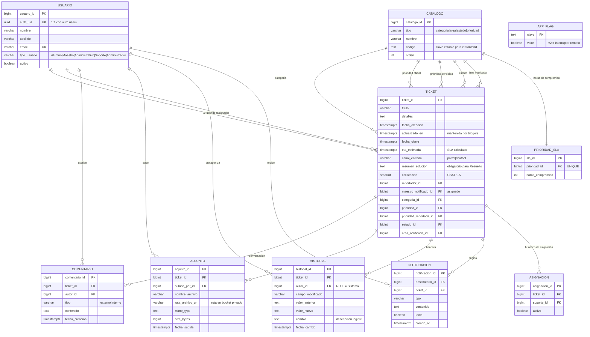

# Anexo técnico — Sistema Integral de Gestión y Seguimiento de Incidencias

**Universidad Lux · Fundamentos de Base de Datos · Premio Idea** — 26 de septiembre de 2026
Material para integrar al documento entregable: sustituye al script T-SQL y al diagrama auto-traducido de la versión anterior, refleja el sistema **realmente desplegado** y no contiene credenciales.

- **Sitio publicado:** https://g-sad-lux.github.io/LuxFBD/ (experiencia V2: agregar `?v2=on`, o el switch "Nueva experiencia" del encabezado)
- **Base de datos:** PostgreSQL 17 en Supabase — todo el backend existe como **17 migraciones versionadas** en [`supabase/migrations/`](../supabase/migrations/), reproducibles con `supabase db push`
- **Repositorio:** https://github.com/G-sad-Lux/LuxFBD

---

## 1. Diagrama entidad-relación

*(10 tablas; `APP_FLAG` es de configuración y no se relaciona con el dominio.)*

## 2. Script de la base de datos

El "script" oficial son las **migraciones** — se ejecutan en orden y dejan la base idéntica a producción:

| # | Archivo | Propósito |
|---|---|---|
| 0001 | `schema` | Las 9 tablas del dominio, 7 FKs de ticket, índices y comentarios |
| 0002 | `seed` | Catálogo con IDs estables (estados 1-5, prioridades, categorías, áreas) + SLA |
| 0003 | `rls` | Row Level Security: denegar por defecto; funciones `usuario_actual()` / `es_staff()` |
| 0004 | `auth_trigger` | Alta en Auth → perfil automático en `usuario` |
| 0005 | `storage` | Bucket privado `tickets` (5 MB, imagen/PDF) + política de carpeta propia |
| 0006 | `security_hardening` | Rol jamás desde el cliente; adjuntos solo a tickets visibles; lectura firmada |
| 0007 | `seed_demo_staff` | Promoción del usuario de soporte de demo (vía servidor) |
| 0008 | `prioridades_v2` | 4 niveles unificados: Crítica/Alta/Media/Baja (SLA 4/8/24/72 h) |
| 0009 | `ticket_columnas_v2` | `canal_entrada`, `prioridad_reportada_id`, `resumen_solucion` |
| 0010 | `reglas_negocio` | **Triggers**: validación de catálogos, máquina de estados, resumen obligatorio, ETA + recálculo, bitácora con valores reales, notificaciones |
| 0011 | `rls_v2` | Comentarios (internos solo staff), historial visible al dueño, notificaciones del destinatario |
| 0012 | `vistas_kpi` | `v_kpi_resumen`, `v_tickets_por_categoria`, `v_tiempo_resolucion` (con `security_invoker`) |
| 0013-0014 | `areas_v2`, `categorias_v2` | Catálogos alineados al documento V2 |
| 0015 | `actualizado_y_area` | `actualizado_en` automático; reasignación de área auditada |
| 0016 | `app_flag` | Interruptor remoto de la experiencia V2 |
| 0017 | `csat_realtime` | Encuesta CSAT (`calificar_ticket()`) + publicación Realtime |

Un dump plano equivalente se genera con `npx supabase db dump -f esquema.sql` (requiere Docker).

## 3. Reglas de negocio dentro de PostgreSQL

| Regla | Mecanismo |
|---|---|
| Máquina de estados: Abierto→En proceso→Esperando respuesta→Resuelto→Cerrado (con reaperturas válidas) | `transicion_valida()` en trigger BEFORE UPDATE; transición inválida = excepción |
| **Retorno automático**: si el alumno responde un ticket "Esperando respuesta", regresa a "En proceso" | Trigger AFTER INSERT de `comentario` |
| Resolver **exige** resumen de solución; Cerrar sella `fecha_cierre` | Trigger BEFORE UPDATE |
| ETA = creación + horas del SLA de la prioridad; **se recalcula** si staff cambia la prioridad | Triggers BEFORE INSERT/UPDATE + `prioridad_sla` |
| Bitácora completa (creación, estado, prioridad, área, asignación, comentarios, notas, evidencias, calificación) con autor y valores anterior/nuevo | Triggers AFTER (SECURITY DEFINER) |
| Notificaciones automáticas (confirmación, cambio de estado, resuelto, asignación, respuestas) | Mismos triggers |
| CSAT: solo el reportador, solo Resuelto/Cerrado, una única vez | Función `calificar_ticket()` expuesta por RPC |
| `actualizado_en` siempre al día | Triggers en ticket/comentario/adjunto |

## 4. Seguridad (modelo aplicado)

- **RLS activo en las 10 tablas, denegar por defecto.** El alumno solo ve/edita lo suyo; las notas internas jamás llegan al portal del estudiante; las notificaciones son del destinatario; nadie escribe la bitácora salvo los triggers.
- El rol **nunca** proviene del cliente (alta → siempre `Alumno`; promociones solo del lado servidor). Registro público **deshabilitado**.
- Evidencias en **bucket privado** con URLs firmadas de 1 hora, subida restringida a carpeta propia, 5 MB, PNG/JPG/PDF.
- Edge Functions sin service role: todo con el JWT del usuario; CORS con allowlist; errores internos no expuestos (las validaciones de la DB sí, código 422).
- Frontend: escape de todo dato del servidor, CSP con SRI, dependencias fijadas.

## 5. Endpoints y accesos

**Edge Functions** (`https://<proyecto>.supabase.co/functions/v1/…`, JWT requerido):

| Método | Ruta | Función |
|---|---|---|
| POST | `/ticket-manager/create` | Crear ticket (+evidencia); respeta área, canal y prioridad percibida |
| GET | `/ticket-manager/list` | Tickets visibles (RLS) con catálogos y personas embebidas |
| GET | `/ticket-manager/details?id=` | Detalle + bitácora + conversación + evidencias con URL firmada |
| PUT | `/ticket-manager/update` | Staff: estado, prioridad, responsable, área, resumen de solución |
| GET/POST | `/ticket-manager/comments` | Conversación; POST crea externo/interno (interno solo staff) |
| GET | `/ticket-manager/staff` | Personal asignable (vacío para alumnos) |
| GET | `/catalog-service` | Catálogos ordenados por `orden` |

**PostgREST directo** (mismo host `/rest/v1/…`, gobernado por RLS): lectura de `catalogo` y `app_flag` (anónimo), `notificacion` propia (+marcar leída), vistas KPI, y `rpc/calificar_ticket`. **Realtime**: `ticket`, `comentario` y `notificacion` publican cambios; cada suscriptor recibe solo lo que su RLS le permite.

## 6. SLA vigente

| Prioridad | Compromiso |
|---|---|
| Crítica | 4 horas |
| Alta | 8 horas |
| Media | 24 horas |
| Baja | 72 horas |

## 7. Operación

- **Interruptor V2** (4 capas): `?v2=on|off` → switch del encabezado (preferencia del usuario) → tabla `app_flag` (global, sin redeploy) → `config.js`.
- **Respaldo/keep-alive**: workflow de GitHub Actions 2×/semana (dump cifrado; requiere secrets del repositorio).
- **Verificación**: suite de 131 comprobaciones que ejecuta las 17 migraciones contra un PostgreSQL efímero y simula alumno/soporte/anónimo/service-role antes de cada despliegue.
- Cuentas de demostración: un perfil `Alumno` y un perfil `Soporte` (credenciales en resguardo del equipo, **nunca en este documento**).
