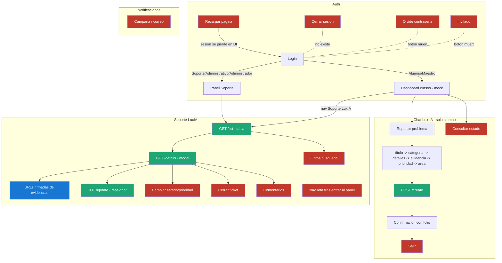

# Mapa de flujos, gaps y mejoras — LuxFBD

**Fecha:** 26 de septiembre de 2026 · **Base:** código en `master` (`5a422c8`) tras la reactivación y el endurecimiento de seguridad.
**Método:** recorrido de **todos** los flujos existentes (23), con su estado real verificado contra el código y contra el backend vivo.

**Leyenda de verificación:** 🟢 probado en vivo · 🔵 probado con la suite (Postgres real en memoria) · ⚪ verificado solo por lectura de código (pendiente de la prueba de humo con login real).

---

## 1. Resumen ejecutivo

| Métrica | Valor |
|---|---|
| Flujos que existen | 23 |
| Funcionan completos | 9 |
| Funcionan con defectos | 8 |
| Rotos o decorativos | 6 |
| Requerimientos v1 cubiertos (RF-001…017) | 4 ✅ · 5 ⚠️ · 8 ❌ (sin cambio: la reactivación restauró, no amplió) |
| Gaps **P0** que pueden romper la demo | **4** |

El sistema hoy hace bien el tramo **crear → listar → ver → reasignar**, con seguridad sólida en la base de datos. Todo el **ciclo de vida posterior** (comentar, cambiar estado, cerrar, ETA, notificar) sigue sin existir, y hay **4 defectos de navegación/sesión** que pueden tirar una demo en vivo.

---

## 2. Mapa de flujos (estado actual)

---

## 3. Flujo por flujo

### A. Autenticación y sesión

| # | Flujo | Estado | Gap | Mejora propuesta | Ref | Prioridad |
|---|---|---|---|---|---|---|
| A1 | Login alumno → dashboard | ⚪ funciona | Mensaje de error solo mapea "Invalid login credentials" | Mapear también "Email not confirmed" y credenciales de red | — | P3 |
| A2 | Login staff → panel | ⚪ funciona | — | — | — | — |
| A3 | **Persistencia de sesión** | ❌ | supabase-js guarda el token, pero al recargar la UI siempre muestra login: en la demo, un F5 accidental "cierra la sesión" | `getSession()` al cargar + `onAuthStateChange` → restaurar la vista según rol | v2 §19 | **P0** |
| A4 | **Cerrar sesión** | ❌ no existe | En equipo compartido (laboratorio) la sesión queda viva | Botón en el chip de perfil → `signOut()` → volver a login | v2 §19, auditoría | **P0** |
| A5 | Recuperar contraseña | ❌ botón muerto | — | `resetPasswordForEmail()` + página de cambio, o quitar el botón | v2 §4.2 | P2 |
| A6 | Entrar como invitado | ❌ botón muerto | Promete "acceso invitado" que no existe | Quitarlo (el registro está deshabilitado a propósito) | — | P3 |
| A7 | Registro de alumnos | ❌ (por diseño hoy) | Signup deshabilitado por seguridad; el alta es manual en dashboard | Decisión v2: registro validado contra padrón (matrícula precargada) o alta masiva por CSV | v2 §4.2 | P2 |
| A8 | Chip de perfil "AT" | 🎭 decorativo | No refleja al usuario real | Mostrar iniciales y nombre del perfil cargado | — | P2 |

### B. Chat Lux-IA (reporte de incidencias)

| # | Flujo | Estado | Gap | Mejora | Ref | Prioridad |
|---|---|---|---|---|---|---|
| B1 | Flujo guiado completo → `/create` | ⚪ funciona | — | Añadir **resumen de confirmación** antes de enviar (patrón v2 fig. 4) | RF-001/002 | P2 |
| B2 | **Consultar estado de ticket** | ❌ "disponible pronto" | Prometido en el doc v1 §8 y en v2; el dato ya existe vía `/list` | Responder en el chat: "Tu ticket #30 está En proceso, asignado a X" | RF-005, v2 §6 | **P0** |
| B3 | Botón "Salir" al terminar | ❌ sin handler | El chat queda sin opciones activas hasta reabrirlo | `exit` → cerrar ventana y `resetChat()` | — | **P1** |
| B4 | Botones de pasos anteriores | ⚠️ | Siguen vivos; responder dos veces corrompe el estado del flujo | Deshabilitar `chat-options` ya usadas | — | P1 |
| B5 | Carrera post-creación | ⚠️ | `step='GREETING'` llega 1 s tarde; clic rápido cae en estado muerto | Setear el estado al renderizar las opciones, sin `setTimeout` | — | P1 |
| B6 | Paso "área a notificar" | ⚠️ teatro | Se pregunta y **el backend lo descarta** (fija 38) | `/create` debe respetar `area_notificada_id` validando que sea tipo `area` | RF-002 | P1 |
| B7 | Adjuntar evidencia | ⚪ funciona | Sin validación previa de 5 MB/tipo (el bucket rechaza con "Error al subir"); 1 solo archivo; si el ticket falla después, queda archivo huérfano | Validar tamaño/tipo antes de subir + mensaje claro; multi-archivo después | RF-002, v2 §5.4 | P2 |
| B8 | Prioridad Baja/Media/Alta | ⚠️ latente | El catálogo dice Bajo/Medio/Crítico. Hoy funciona por los mapas estáticos, pero si `loadCatalogs()` llegara a correr logueado, las claves no coinciden y **todo caería a "Bajo"** | Mapear por `codigo` del catálogo, no por `nombre`; unificar etiquetas | — | P1 |
| B9 | "Hemos notificado a soporte" | ❌ falso | No existe notificación alguna | Ver bloque D | RF-016 | P1 |

### C. Panel de soporte y detalle

| # | Flujo | Estado | Gap | Mejora | Ref | Prioridad |
|---|---|---|---|---|---|---|
| C1 | **Nav "Soporte LuxIA" sin sesión** | ❌ rompe la página | Ejecuta `/list` sin token (error) y **oculta todas las secciones sin restaurarlas**: la página queda vacía hasta recargar | Guard de sesión en la nav + funciones `showX()` simétricas que restauren vistas | — | **P0** |
| C2 | Nav Inicio/Tablero/Mis cursos tras entrar al panel | ❌ rotas | `showSupportView()` esconde `<section>` con `display:none` y nadie las revierte | Mismo fix que C1 (un router mínimo de 3 vistas) | — | **P0** (mismo fix) |
| C3 | Tabla de tickets `/list` | 🟢 (staff) ⚪ (alumno) | Sin filtros, búsqueda, orden ni paginación; faltan columnas categoría y reportador; sin hora | Filtros por estado/categoría/prioridad + búsqueda por folio/título (client-side basta con <500 tickets) | RF-010, v2 §9 | P1 |
| C4 | Badges de estado | ⚠️ | Solo "Abierto"/"Cerrado" tienen estilo; los otros 3 estados salen genéricos | Clase por `codigo` del estado | RF-006 | P2 |
| C5 | Detalle `/details` + evidencias firmadas | 🔵 backend · ⚪ UI | URL firmada dura 1 h: si el modal queda abierto más tiempo, la imagen muere | Regenerar al reabrir; aceptable para v1 | — | P3 |
| C6 | **ETA "Pendiente" fijo** | ❌ | `prioridad_sla` ya está sembrada (4/24/72 h) y `ticket.eta_estimada` existe, pero nada la calcula ni la muestra | Trigger `BEFORE INSERT` que fije `eta_estimada`; UI con semáforo (en tiempo / por vencer / vencido) | RF-007, v2 §17 | **P1** |
| C7 | **Comentarios público/interno** | ❌ no existe | Tabla `comentario` creada y sin usar; es el gap funcional más grande (3 RFs) | Políticas RLS (externo: dueño+staff; interno: solo staff) + endpoints `/comments` GET/POST + hilo en el modal con pestañas "Respuesta pública / Nota interna" (v2 fig. 7) | RF-003/008/014, v2 §13 | **P1** |
| C8 | **Cambiar estado / prioridad** | ❌ sin UI | `/update` ya acepta `estado_id`; prioridad no la acepta nadie | Dropdowns de estado y prioridad en el modal + `/update` con validación de tipo de catálogo | RF-013, v2 §12 | **P1** |
| C9 | **Resolver / cerrar ticket** | ❌ | `fecha_cierre` nunca se llena; sin resumen de solución | Botón "Resolver" que exige resumen (v2 §16) → estado 4/5 + `fecha_cierre` + historial | RF-015 | **P1** |
| C10 | Reasignar | 🟢 (Soporte) | **`Administrador` ve el control pero `/update` lo rechaza (403)**: la función lista `['Administrativo','Maestro','Soporte']` y la RLS otro conjunto | Unificar roles en una sola constante (función) alineada con `es_staff()` | — | **P1** |
| C11 | Historial | ⚪ parcial | Solo registra reasignaciones; sin evento de creación; `valor_anterior` siempre `'-'` | Triggers en DB (`AFTER INSERT` ticket, `AFTER UPDATE` de estado/prioridad/asignación) con valores reales → deja de depender del service role | RF-004/012, v2 §18 | **P1** |
| C12 | Realtime / refresco | ❌ | La tabla no se actualiza sola | Botón refrescar (P2); Supabase Realtime después (P3) | v2 §9 | P2/P3 |

### D. Notificaciones

| # | Flujo | Estado | Gap | Mejora | Ref | Prioridad |
|---|---|---|---|---|---|---|
| D1 | Campana 🔔 / sobre ✉️ | 🎭 decorativos | Tabla `notificacion` creada, sin políticas, sin escritores, sin UI | Triggers de DB insertan (creación→reportador confirmación; asignación→asignado; cambio de estado→reportador) + política SELECT/UPDATE(leida) del destinatario + dropdown con badge de no leídas | RF-016/017, v2 fig. 5-7 | **P1** |
| D2 | Correo | ❌ | — | Fase posterior (Resend/SMTP); las in-app primero | RF-016 | P3 |

### E. Dashboard de cursos (mock) y otros

| # | Flujo | Estado | Nota |
|---|---|---|---|
| E1 | Tarjetas de cursos, filtros, "Tarjeta/Lista", menús ⋮, "Mostrar" | 🎭 decorativos | Escenografía del campus: válida para la demo; v2 lo sustituye por el panel "Mis Tickets" con contadores (fig. 5). No invertir aquí. |
| E2 | Visor de imágenes (lightbox) | ⚪ funciona | Cierra con clic fuera y con ×; falta tecla Escape (P3) |
| E3 | Footer/branding "Lux Studio", título "Sitio Sencillo y Responsivo" | ⚠️ | Cambiar a "Universidad Lux — Soporte" antes de presentar (P2, 5 min) |

### F. API y datos (flujos no visibles)

| # | Flujo | Estado | Gap | Prioridad |
|---|---|---|---|---|
| F1 | `/create` | 🔵 | No valida que `categoria_id` sea tipo `categoria` ni `prioridad_id` ∈ prioridades: por REST se puede crear un ticket con "Abierto" como prioridad (integridad, no seguridad — RLS ya impide suplantar) | P1 (junto con C8) |
| F2 | `/create` adjunto | ⚪ | Si el insert del adjunto falla, se traga el error: ticket "creado con éxito" sin evidencia | P1 |
| F3 | `catalog-service` | 🟢 | Solo se llama **antes** del login (siempre 401→estáticos); nunca se reintenta logueado | P1 (con B8) |
| F4 | `estado_id=5` vía `/update` | 🔵 | No llena `fecha_cierre`; historial dice "Estado 5" sin nombre | P1 (con C9) |
| F5 | Paginación de `/list` | ⚪ | Sin límite: con miles de tickets degradará | P3 |

### G. Operación

| # | Flujo | Estado | Gap | Prioridad |
|---|---|---|---|---|
| G1 | **Respaldo + keep-alive** | ❌ **no existe** | Estructura reconstruible (migraciones ✓) pero **los datos no**; el plan Free pausa a ~7 días de inactividad — así se perdió el proyecto anterior | **P0 operativo** |
| G2 | Proyecto en cuenta personal | ⚠️ | Sin Organización de equipo: punto único de falla humano | P0 operativo (acción de ustedes, 10 min) |
| G3 | Despliegue de funciones/migraciones | ⚠️ manual | Pages es automático; el backend se despliega a mano con CLI | P2: GitHub Action en push a `master` |
| G4 | Alta de usuarios | ⚠️ manual | Dashboard + SQL de promoción; sin runbook escrito para el equipo | P2 |
| G5 | Monitoreo | ❌ | Solo logs de funciones vistos a mano | P3 |

---

## 4. Bugs latentes conocidos (no rompen hoy, van a morder)

1. **B8**: claves de `PRIORITY_MAP` por nombre → si los catálogos cargan logueado, toda prioridad cae a "Bajo". Corregir por `codigo`.
2. **B5**: carrera de 1 s del chat tras crear ticket.
3. **C5**: firma de 1 h en evidencias con modal abierto.
4. CSP fija el host del proyecto y permite `ws://localhost` (dev) en producción — inofensivo, pero recordar al migrar de proyecto.
5. `Maestro` pasa el check de rol de `/update` pero RLS le bloquea el UPDATE → 400 confuso si alguna vez existe un maestro (unificar con C10).

## 5. Hoja de ruta propuesta

| Fase | Contenido | Esfuerzo | Resultado |
|---|---|---|---|
| **P0 — a prueba de demo** (antes de presentar nada) | A3 sesión persistente · A4 logout · C1/C2 router de vistas con guard · B2 consultar estado en chat · **G1 workflow respaldo+keepalive** · G2 organización | ~1 día | La demo no se rompe con un F5, un clic fuera de orden ni un proyecto pausado |
| **P1 — ciclo de vida completo** (cierra los 8 RFs faltantes) | C7 comentarios · C8 estado+prioridad · C9 resolver/cerrar con resumen · C6 ETA con semáforo · C11 historial por triggers · D1 notificaciones in-app · C10/B6/B8/F1-F4 consistencia de roles/área/catálogo | ~4-5 días | 17/17 RFs y las bases de v2 §12-18 |
| **P2 — experiencia** | C3 filtros/búsqueda · C4 badges · B1 confirmación · B7 validación de archivos · A5 reset password · A8 chip real · E3 branding · G3 CI · G4 runbook | ~3 días | Panel a la altura de las figuras v2 |
| **P3 — v2 diferenciadores** | QR + chat móvil (Lumix) · panel "Mis Tickets" con stats · registro validado · CSAT · reportes SQL (top categorías, MTTR, cumplimiento SLA) · realtime | por alcance | Lo que luce en el Premio Idea |

**Regla de oro que ya nos funcionó:** todo lo de P1 que sea regla de negocio (ETA, historial, notificaciones, validación de catálogo) va **en la base de datos como triggers/funciones en migraciones**, no en el frontend — es más robusto, sobrevive a cualquier cliente y es exactamente lo que la materia evalúa.

## 6. Verificación pendiente

La **prueba de humo end-to-end** sigue detenida en el login (requiere que teclees la contraseña en el panel del navegador). Hasta completarla, los flujos ⚪ (login por rol, chat completo con evidencia firmada, reasignación desde UI) están verificados por código y suite, pero no en vivo. Es el primer paso antes de arrancar P0.
