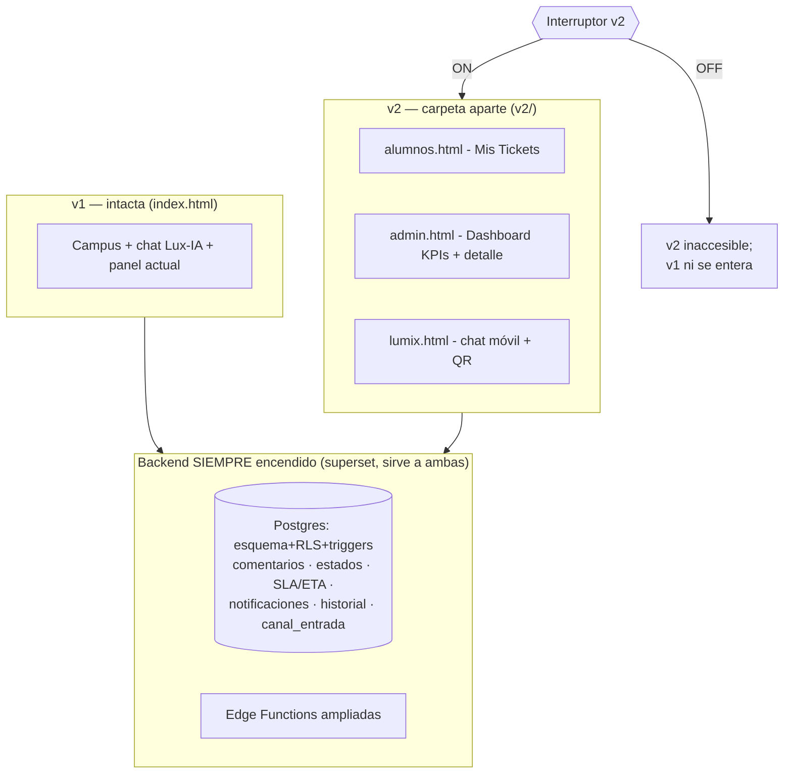

# Plan V2 conmutable — "Sistema Integral de Gestión y Seguimiento de Incidencias"

**Fecha:** 26 de septiembre de 2026 · **Base:** documento V2 (23 secciones + 7 figuras) contra el sistema vivo (`master`, v1 reactivada y endurecida).
**Requisito rector (del equipo):** la V2 se construye **encima** de la v1 y debe poder **apagarse o prenderse completa** — con todo lo que trae — sin afectar la v1.

---

## 1. Principio de arquitectura: tres capas, un interruptor

**Las tres reglas que hacen esto seguro:**

1. **El backend es un superset compartido y siempre está encendido.** Todo lo que la V2 exige del lado de datos (comentarios, máquina de estados, resumen de resolución, SLA/ETA, notificaciones, canal de entrada, prioridad oficial vs. capturada) son **adiciones** — tablas/columnas/triggers nuevos que la v1 no consulta y por tanto no la alteran. Además la mayoría son los mismos RF-003…017 que la v1 debía cumplir: se construyen una vez y sirven a las dos.
2. **La V2 vive en archivos separados (`v2/`).** `index.html` no importa nada de ahí. Apagada, la v1 es byte a byte la de hoy — riesgo de regresión: cero.
3. **Un solo interruptor maestro** gobierna toda la experiencia V2 (no flags por feature, que se vuelven inmanejables).

## 2. El interruptor: mecánica exacta

Resolución en cascada (la más específica gana):

| Capa | Cómo | Cuándo usarla | Latencia de apagado |
|---|---|---|---|
| 1. URL | `?v2=off` / `?v2=on` (se persiste en `localStorage`) | **Kill-switch en plena demo**: si algo falla en vivo, un parámetro y estás en v1 | inmediata |
| 2. `config.js` | `window.appConfig = { v2: true }` | Estado por defecto del despliegue | 1 commit (~1 min de Pages) |
| 3. (Opcional, fase F5) tabla `app_flag` en DB | `select valor from app_flag where clave='v2'` | Apagar remotamente sin tocar el repo (desde SQL Editor) | inmediata, sin deploy |

Comportamiento:
- **ON** → `index.html` muestra un acceso "✨ Nueva experiencia" hacia `v2/alumnos.html`; el QR del login apunta a `v2/lumix.html`; las páginas v2 operan normal.
- **OFF** → el acceso desaparece de v1, y **cada página v2 se auto-verifica**: muestra "Esta versión está desactivada" con enlace a la v1 (así "apagar" apaga de verdad, aunque alguien tenga la URL guardada).

## 3. Qué trae la V2 y dónde cae cada cosa

### 3.1 Backend compartido (se construye una vez, siempre encendido)

| # | Pieza (sección del doc) | Qué es | Estado hoy |
|---|---|---|---|
| B1 | Comentarios públicos + notas internas (§13) | Políticas RLS sobre `comentario` + endpoints + evento de historial | Tabla creada, sin uso |
| B2 | Máquina de estados con transiciones válidas (§15) — incl. `Esperando respuesta → En proceso` cuando el alumno responde | Función SQL `cambiar_estado()` + trigger | Estados sembrados |
| B3 | Resolución con **resumen obligatorio** (§16) | Columna `resumen_solucion` + regla: no se puede pasar a Resuelto sin él; llena `fecha_cierre` | No existe |
| B4 | SLA/ETA (§17): `eta_estimada` al crear + **recálculo al cambiar prioridad** + estado del semáforo | Triggers sobre `ticket` usando `prioridad_sla` | Tabla sembrada (4/24/72 h), nadie la usa |
| B5 | Auditoría de 10 eventos (§18) | Triggers → `historial` con valores reales | Solo reasignación, vía service role |
| B6 | Notificaciones (§ fig. 5-7, RF-016/017) | Triggers → `notificacion` + política del destinatario + marcar leída | Tabla creada, sin uso |
| B7 | `canal_entrada` del ticket (§9: Lumix vs Portal Web) | Columna nueva; `/create` la recibe | No existe |
| B8 | Prioridad **capturada vs. oficial** (§5.3/§10) | Columna `prioridad_reportada_id` (nullable); la oficial (`prioridad_id`) la gobierna staff | No existe |
| B9 | Área notificada real (§11, + áreas Cajas y Administración) | `/create` respeta `area_notificada_id` validado + seed de áreas | Hardcode 38 |
| B10 | Vistas SQL de KPIs (§9: abiertos, por vencer, alta prioridad, sin asignar, resueltos hoy) | `create view` — cero riesgo | No existe |

> B1-B6 y B9 son exactamente el backlog **P1** de [FLUJOS_Y_GAPS.md](FLUJOS_Y_GAPS.md): la V2 no duplica ese trabajo, lo consume.

### 3.2 Capa V2 conmutable (solo presentación/flujo)

| # | Pieza | Figura | Contenido |
|---|---|---|---|
| U1 | `v2/alumnos.html` — "Mis Tickets" | fig. 5 | Contadores (activos / esperando respuesta / resueltos), búsqueda y filtros, tarjetas de ticket, panel lateral con línea de tiempo y conversación, botón "Responder" |
| U2 | `v2/admin.html` — Gestión de Incidencias | fig. 6 y 7 | KPIs arriba, tabla con folio/canal/prioridad/SLA con barra, filtros y paginación; detalle con gestión de estado/prioridad/responsable, SLA restante, conversación con pestañas "Respuesta pública / Nota interna", "Resolver Ticket" con resumen |
| U3 | `v2/lumix.html` — chat móvil standalone | fig. 4 | La misma máquina de estados del chat v1 (reutilizada), branding **Lumix** + mascota, optimizada a pantalla completa móvil; **no pregunta prioridad** (§5.3) |
| U4 | QR de acceso (§5.2) | fig. 3 | QR en el login (generado build-time, apunta a la URL pública de `v2/lumix.html`) |
| U5 | Branding Lumix (nombre, mascota, copy §5.1) | fig. 1-4 | Solo en v2; la v1 conserva "Lux-IA" |
| U6 | `v2/shared.js` + `shared.css` | — | Cliente de API (el helper que la v1 nunca tuvo), sesión, flags, `esc()`, catálogos por `codigo`, tokens de diseño de las figuras (azul institucional) |

Rutas del doc (§20) → archivos estáticos (GitHub Pages no tiene rewrites): `/admin/dashboard` → `v2/admin.html`, `/admin/tickets/[id]` → `v2/admin.html#ticket=35`, `/alumnos/mis-tickets` → `v2/alumnos.html`, `/chat/lumix` → `v2/lumix.html`, `/alumnos/login` y `/admin/login` → pantalla de acceso propia de cada página.

### 3.3 Conflictos v1↔v2 que el interruptor RESUELVE solo

| Conflicto | Con v2 OFF | Con v2 ON |
|---|---|---|
| ¿Quién fija la prioridad? (v1: alumno elige · v2 §5.3/§10: solo staff) | Chat v1 pregunta; se guarda en `prioridad_reportada_id` **y** en la oficial | Lumix no pregunta; `prioridad_reportada_id` = null; oficial nace "Baja" hasta que staff la fije |
| Un portal vs. dos portales (§8) | Todo en `index.html` | Portales separados en `v2/` |
| Lux-IA vs Lumix | Lux-IA | Lumix |
| Notificaciones "¿dentro o fuera del alcance?" (contradicción §23 vs figs.) | Backend las registra igual (B6); v1 no las muestra aún | Campana con contador en ambas páginas v2 |

### 3.4 Decisiones que el interruptor NO resuelve (las necesito del equipo)

1. **Catálogo de prioridades: ¿3 o 4 niveles?** v1 usa Bajo/Medio/Crítico; V2 exige Baja/Media/Alta/**Crítica** (§10). El catálogo es **uno solo** para ambas versiones (los tickets son los mismos). Recomiendo unificar a 4 con una migración (renombrar por `codigo`, el fix B8 ya nos independizó de los nombres) y definir SLA de 'Alta' (propongo 8 h).
2. **¿Quién puede reportar en modo v2?** El doc V2 habla solo de estudiantes; la v1 (y el doc v1) incluía maestros y administrativos. El backend soporta ambos; es una decisión de producto.
3. **Registro self-service (§4.2).** Hoy el alta es administrada (signup deshabilitado — decisión de seguridad F1). Habilitarlo en v2 exige validación real (dominio institucional + confirmación de correo, o padrón de matrículas). Recomiendo **mantener alta administrada** para el Premio Idea y dejar el registro para después.

## 4. Garantía de "apagado"

- v2 OFF ⇒ `index.html` no carga ni un byte de `v2/` (solo evalúa el flag para ocultar el acceso). La v1 queda **idéntica a la de hoy**.
- Las adiciones de backend son *additive-only*: columnas nullable/con default, tablas que la v1 no consulta, triggers que escriben en tablas nuevas. Toda migración de esta fase pasa por la suite PGlite **con los flujos v1 como regresión** (la misma que hoy: 59 checks) antes de tocar el proyecto real.
- Rollback en demo: `?v2=off` → recarga → v1. Rollback de despliegue: 1 línea en `config.js`.

## 5. Fases y esfuerzo

| Fase | Contenido | Esfuerzo | Entregable verificable |
|---|---|---|---|
| **F0** | Interruptor (3 capas) + esqueleto `v2/` + `shared.js` (cliente API, sesión, flags) | 1 día | `?v2=on/off` funcionando; página v2 "hola" que se apaga |
| **F1** | Backend compartido B1-B10 (= P1 + columnas v2), con migraciones + suite | 4-5 días | 17/17 RFs del doc v1 en verde vía API |
| **F2** | `v2/alumnos.html` (fig. 5) | 2 días | Mis Tickets con stats, filtros y conversación |
| **F3** | `v2/admin.html` (fig. 6-7) | 3 días | Dashboard KPIs + detalle con resolución y notas internas |
| **F4** | `v2/lumix.html` + QR (fig. 3-4) | 1.5 días | Reporte end-to-end desde un teléfono escaneando el QR |
| **F5** | Branding/mascota, flag en DB (opcional), pulido y CSP para `v2/` | 1 día | — |
| | **Total** | **~12-13 días de equipo** | |

Orden recomendado: F0 → F1 → F3 → F2 → F4 → F5 (el panel admin es lo que más luce ante el jurado y lo que más depende de F1).

## 6. Riesgos específicos de esta arquitectura

| Riesgo | Mitigación |
|---|---|
| El superset de backend rompe algo de v1 | Additive-only + suite PGlite con regresiones v1 obligatoria antes de cada `db push` |
| Divergencia de lógica duplicada v1/v2 | `shared.js` concentra API/sesión/catálogos; la v1 se migra a usarlo **solo** en fase posterior (no ahora, para no tocarla) |
| CSP actual solo contempla `index.html` | Las páginas `v2/` llevan su propia meta CSP (mismo template) |
| El QR impreso en el documento/póster apunta a una URL que luego cambia | El QR apunta a `https://g-sad-lux.github.io/LuxFBD/v2/lumix.html` — estable mientras no se renombre el repo |
| 4 prioridades rompen el mapa del chat v1 | El fix B8 (claves por `codigo`) ya lo absorbe: solo se agrega el código nuevo al seed |

## 7. Qué sigue

1. Respuestas a las **3 decisiones** de §3.4 (prioridades, reporteros, registro).
2. Cerrar la prueba de humo pendiente de la fase soporte (independiente de esto).
3. Arrancar F0+F1.
